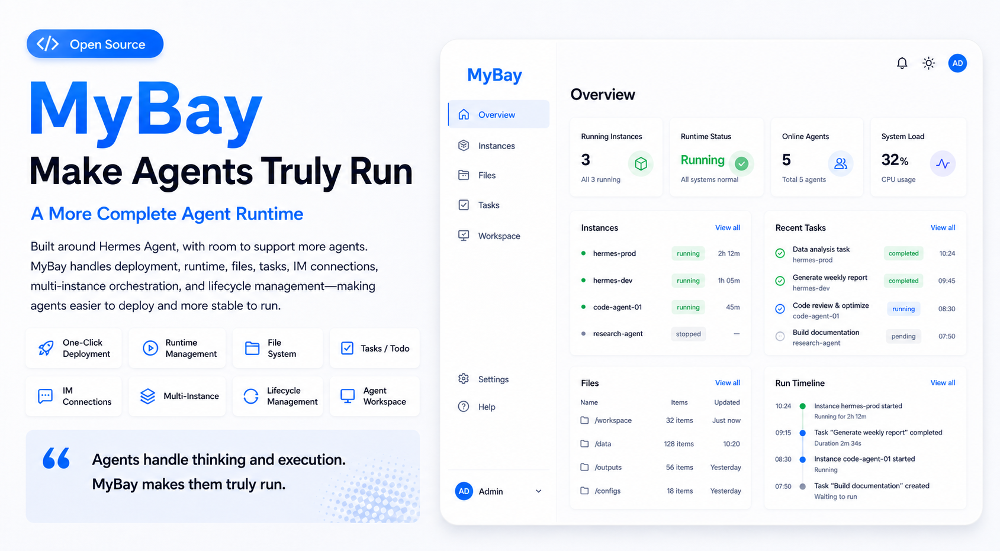
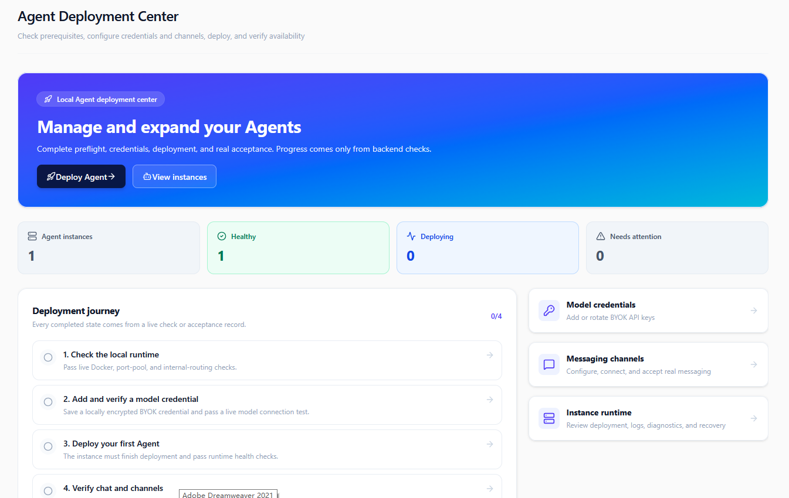
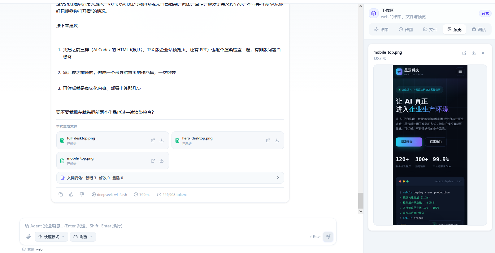
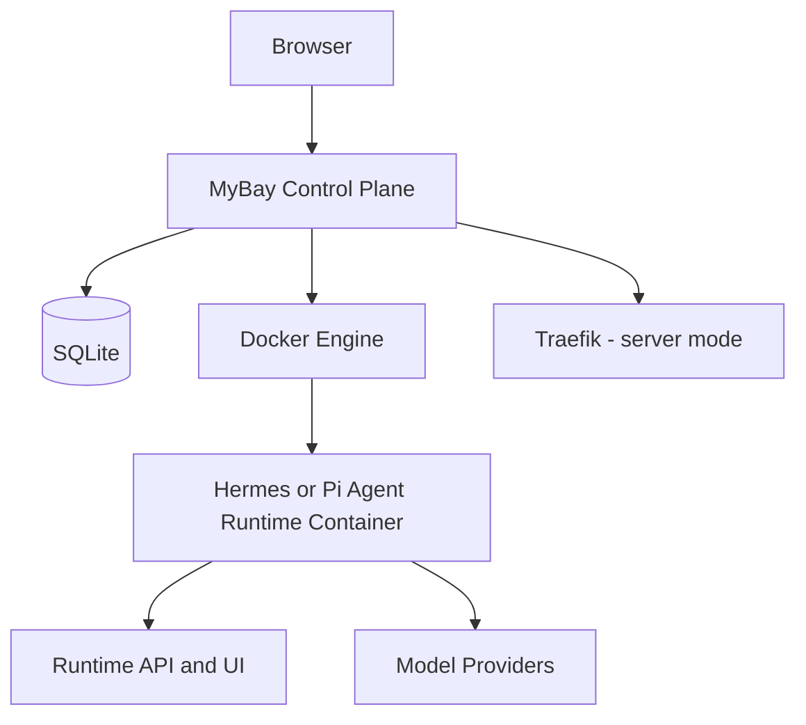

<div align="center">

# MyBay

### Run Agents that work, collaborate, and deliver.

An open-source, local-first control plane for deploying and operating multiple isolated Agent Runtimes on infrastructure you control.

[Quick Start](#quick-start) · [Why MyBay](#why-mybay) · [Runtime Foundations](#runtime-foundations) · [Documentation](#find-the-right-guide) · [Roadmap](./ROADMAP.md)

[](https://github.com/mybay-ai/mybay/actions/workflows/ci.yml)
[](https://github.com/mybay-ai/mybay/actions/workflows/security.yml)
[](https://github.com/mybay-ai/mybay/releases/latest)
[](./LICENSE)

English · [简体中文](./README.zh-CN.md)

</div>

> **Current release: `v0.1.27.1`.** Public interfaces, Runtime adapters, deployment details, and upgrade behavior may still change during the 0.x series.



## Why MyBay?

An Agent that can answer is useful. An Agent that can be deployed, given real files, connected to other Agents, observed, upgraded, and recovered is ready for ongoing work. MyBay brings those parts together in one self-hosted product.

| What you need | What MyBay provides |
| --- | --- |
| **One place to operate Agents** | Preflight, deployment, health, logs, restart, upgrade, rollback, and diagnostics from one console. |
| **Real work, not chat alone** | Uploads, generated files, change summaries, previews, downloads, and persisted workspaces beside the conversation. |
| **More than one Agent foundation** | A shared product experience across certified Hermes Agent and Pi Agent integrations. |
| **Agent-to-Agent collaboration** | Discover peers, authenticate calls, follow delegated tasks, inspect evidence, cancel work, and recover state through A2A. |
| **Control over data and models** | Local SQLite state, isolated Docker workspaces, self-hosted deployment, and bring-your-own model credentials. |
| **Operational confidence** | Runtime certification, backups, security guards, HTTPS server mode, CI, and checksummed release artifacts. |

MyBay Open Source runs without a hosted SaaS dependency, cloud master node, account registration, or paid quota. Docker provides the Runtime substrate, while SQLite keeps control-plane state on your machine.

## From prompt to delivered result

1. **Create an Agent** — choose a Runtime foundation, model provider, limits, and supported channels.
2. **Give it real work** — chat, attach files, approve sensitive tools, and follow live execution.
3. **Inspect the output** — preview and download generated files with attributable run evidence.
4. **Collaborate when needed** — delegate through A2A and track each remote task to a truthful terminal state.
5. **Keep it running** — diagnose, back up, upgrade, roll back, and recover without leaving the control plane.

## Runtime foundations

MyBay separates the product control plane from the Agent Runtime. You can choose the foundation that fits the work while keeping a consistent deployment, conversation, file, collaboration, and lifecycle experience.

| Runtime foundation | Release status | Best suited for | Declared product surface |
| --- | --- | --- | --- |
| **Hermes Agent** | Certified and verified | General-purpose, tool-rich Agent workflows | Streaming and batch chat, files, shell, browser, schedules, Web and supported messaging channels |
| **Pi Agent** | Certified and verified | Coding and workspace-oriented Agent workflows | Streaming chat, files, shell, cancellation, session recovery, approvals, usage, and Web access |
| **More foundations** | Roadmap | Additional open-source Agent Runtimes | Integrated through the Runtime manifest, adapter contract, capability guards, and certification ladder |

The generated [Runtime Capability Matrix](./docs/runtime-capability-matrix.md) is the source of truth for currently declared capabilities and channels. [MyBay Runtime Certification](./docs/runtime-certification.md) reports evidence-backed verification separately; registration or a capability declaration alone does not prove product E2E behavior.

## Quick Start

**Windows 10/11: download, extract, and double-click**

Download `MyBay-Windows-v*.zip` from the [latest release](https://github.com/mybay-ai/mybay/releases/latest), extract it to a normal local directory such as `C:\MyBay`, and double-click:

```text
Start-MyBay.bat
```

The launcher checks Windows, virtualization, WSL, Docker, ports, and image connectivity; installs and starts Docker Desktop when needed; pulls the version-pinned MyBay image; asks you to choose the administrator password; and opens the browser after the health check passes. WSL setup registers a one-time continuation when Windows must restart, so installation resumes after the next sign-in. Git, Node.js, npm, and OpenSSL are not required.

**macOS or Linux**

Prerequisite: Docker Engine or Docker Desktop with Docker Compose. Host Node.js is not required.

```bash
git clone https://github.com/mybay-ai/mybay.git
cd mybay
chmod +x quick-start.sh
./quick-start.sh
```

Open [http://localhost:3000](http://localhost:3000), add a model provider, and deploy your first Agent with the Hermes Agent or Pi Agent foundation. Never share or commit `.env`.

For a first task that creates a file, select **Agent mode** beside the chat input. The default **Quick mode** replies with text only and does not execute tools or save files.

Need LAN access, public HTTPS, manual Compose, or a development setup? See [Deployment options](#deployment-options) or the complete **[Deploy Your First Agent in 10 Minutes](./docs/QUICKSTART.md)** guide.

## Product Preview

### Bring up your own Agent control plane

Choose Quick Start or a manual Docker deployment to run and manage AI Agents on infrastructure you control.


### Deploy and operate every instance

Complete environment preflight checks, configure model credentials, deploy Agents, connect messaging channels, and inspect runtime health from one local control plane.



### Turn conversations into files and results

Chat with an Agent while viewing execution progress, generated files, file-change summaries, and supported previews in the same workspace.



## Runtime projects and attribution

MyBay is an independent open-source project. Hermes Agent and Pi Agent are separate third-party projects integrated through their public packages, Runtime, or container interfaces. Their inclusion does not imply sponsorship, endorsement, or affiliation. MyBay is not an official Nous Research or Earendil Works product.

See [THIRD_PARTY_NOTICES.md](THIRD_PARTY_NOTICES.md) for licensing and attribution details. The hosted MyBay service at [mybay.ai](https://mybay.ai) is a separate commercial offering and is not required to install or operate this repository.

---

## Deployment options

> New to MyBay? Start with the copy-and-paste [Quick Start](#quick-start) above. This section covers additional deployment modes.

### Method 1: Local Desktop Quick Start

Prerequisites: Docker Engine or Docker Desktop and Docker Compose. Host Node.js is not required. On Windows, the launcher can install Docker Desktop through `winget` when explicitly requested. The macOS/Linux launcher additionally uses `openssl` and standard POSIX shell tools; the Windows launcher uses the built-in .NET cryptography APIs instead.

Use this mode when the browser and Docker run on the same computer:

**Windows PowerShell 5.1 or PowerShell 7:**

```powershell
Set-ExecutionPolicy -Scope Process Bypass
.\quick-start.ps1 -InstallPrerequisites
```

`-InstallPrerequisites` installs Docker Desktop if missing, starts it, and waits for the Docker engine. Installation may request administrator approval or a Windows restart; after restarting, run the same command again. If Docker is already installed and running, you may omit this option and use `.\quick-start.ps1`.

**macOS or Linux:**

```bash
chmod +x quick-start.sh
./quick-start.sh
```

The control panel and Agent ports bind to `127.0.0.1` by default.
To share MyBay with devices on the same local network, bind one exact host address:

```bash
./quick-start.sh --lan 192.168.1.20
```

```powershell
.\quick-start.ps1 -Mode lan -LanBindIp 192.168.1.20
```

### Method 2: Public Server with Automatic HTTPS

Before starting, point the control-panel domain and the wildcard Agent domain to the server. Then run:

```powershell
.\quick-start.ps1 -Mode server
```

or on macOS/Linux:

```bash
chmod +x quick-start.sh
./quick-start.sh --server
```

The script asks for the control-panel domain, Agent root domain, and certificate email. It starts Traefik, obtains HTTPS certificates, and exposes only ports 80/443 publicly. For example, configure DNS records for `console.example.com` and `*.agents.example.com`.

> Both Quick Start launchers create `.env`, generate strong security secrets and an admin password, and preserve an existing server-mode configuration on subsequent runs. They use the same Docker Compose and environment contract.

---

### Method 3: Standard Docker Compose Setup

1. **Clone the repository and copy environment configuration:**
   ```bash
   git clone https://github.com/mybay-ai/mybay.git
   cd mybay
   cp .env.example .env
   ```

2. **Configure required security values in `.env`:**
   ```bash
   # ENCRYPTION_KEY and the internal routing secret must each be 64 hex characters.
   openssl rand -hex 32
   openssl rand -hex 32

   # JWT_SECRET must contain at least 32 bytes.
   openssl rand -base64 48
   ```
   Assign the generated values to `ENCRYPTION_KEY`, `MYBAY_INTERNAL_ROUTING_SECRET`, and `JWT_SECRET`. Also set `LOCAL_ADMIN_USERNAME` and a strong `LOCAL_ADMIN_PASSWORD`. These are the same required values enforced by `docker-compose.yml`.

3. **Start with Docker Compose:**
   ```bash
   docker compose up -d
   ```
   *(Or `docker-compose up -d` on older Docker versions)*

4. **Access the Console:**
   Open `http://localhost:3000` in your browser. Log in with your configured admin credentials.

---

### Method 4: Local Node.js Development

#### Prerequisites
- Node.js 22.16.0 or later and npm
- Docker Engine / Docker Desktop installed and running (required for spawning Agent containers)

1. **Install Dependencies:**
   ```bash
   npm install
   ```

2. **Setup `.env` Configuration:**
   ```bash
   cp .env.example .env
   ```
   Edit `.env` and set `JWT_SECRET`, `ENCRYPTION_KEY`, and admin credentials.

3. **Run Development Server:**
   ```bash
   npm run dev
   ```

4. **Production Build & Start:**
   ```bash
   npm run build
   NODE_ENV=production npm start
   ```

Open [http://localhost:3000](http://localhost:3000) to access the control panel.

`VITE_PUBLIC_APP_URL` and `VITE_MYBAY_PLATFORM_ORIGIN` are build-time values. Docker Compose forwards them as Docker build arguments; changing them requires rebuilding the image. Runtime-only server variables continue to come from `.env`, while Compose always runs the control plane with `NODE_ENV=production`.

---

## Key Environment Variables

| Variable | Description | Default |
| --- | --- | --- |
| `PORT` | Web server listening port | `3000` |
| `NODE_ENV` | Server mode; Compose forces production | `development` in `.env.example` |
| `LOCAL_ADMIN_USERNAME` | Web console login username | `admin` |
| `LOCAL_ADMIN_PASSWORD` | Web console login password | `change-me-now` |
| `JWT_SECRET` | Secret key for signing session tokens (min 32 bytes) | *Replace in .env* |
| `ENCRYPTION_KEY` | 64-char hex key for AES-256 key encryption | *Required* |
| `MYBAY_INTERNAL_ROUTING_SECRET` | 64-char hex secret for internal instance routing | *Required* |
| `VITE_PUBLIC_APP_URL` | Public frontend URL embedded at Docker/Vite build time | `http://localhost:3000` |
| `VITE_MYBAY_PLATFORM_ORIGIN` | Platform origin passed to the frontend build | `http://localhost:3000` |
| `MY_BAY_IMAGE` | Docker image for spawned Hermes Agents | `nousresearch/hermes-agent` |
| `MYBAY_SQLITE_PATH` | Path to the on-machine SQLite database | `data/mybay.sqlite` |

---

## Local Data Storage

All runtime state, container configurations, chat histories, uploaded files, and logs are persisted locally in the `data/` directory:

```txt
data/
  mybay.sqlite        # On-machine SQLite database (instances, credentials, tasks and settings)
  instances/          # Agent workspace mounts and instance runtime data
  uploads/            # User uploaded files and assets
  logs/               # System and deployment logs
```

> **Note:** Do not commit the `data/` directory to git repository.

---

## Security Considerations

- This open-source edition is designed for trusted local environments and private servers.
- For a public server, use `./quick-start.sh --server`; it provisions Traefik and HTTPS and keeps dynamic Agent ports off the public interfaces.
- The Control Plane requires `/var/run/docker.sock` for instance lifecycle management. Access to this socket grants high-privilege control over the Docker daemon and can amount to host-level administrative capability.
- Treat MyBay administrator access as privileged host administration. Do not expose the Control Plane directly to the public internet without protection.
- For internet-facing deployments, use a strong administrator password, a hardened reverse proxy, HTTPS, and preferably a VPN, private network, or IP allowlist.
- Never commit `.env`, `data/`, or real API keys to version control.

---

## Runtime support status

- **Hermes Agent:** Available, deployable, and verified at MyBay's `certified` level. The declared surface includes streaming and batch conversations, cancellation, files, shell, browser, schedules, Web, and supported messaging channels.
- **Pi Agent:** Available, deployable, and verified at MyBay's `certified` level. Its declared surface includes streaming conversations, cancellation, files, shell, and Web access, with native session recovery, attributable usage, stable tool events, approval handling, and persisted artifacts.

The control plane applies capability guards to features a selected Runtime does not declare. Check the generated [capability matrix](./docs/runtime-capability-matrix.md) before depending on a particular channel or conversation mode.

---
## Architecture



SQLite uses WAL journaling, transactional migrations, and explicit schema versioning. The control plane manages containers through the Docker socket; server mode places Traefik in front of the console and Agent runtimes. See the [architecture source of truth](./docs/architecture.md).

## Backup and diagnostics

```bash
npm run doctor
npm run doctor -- --json
npm run backup -- --output /secure/path/mybay-backup
npm run backup:verify -- --backup /secure/path/mybay-backup
```

Backup creates a consistent SQLite snapshot rather than copying a live WAL database. It includes instance workspaces and uploads when present, writes a checksummed manifest, and excludes `.env`, logs, caches, and container images. Treat backups as sensitive. See [self-host operations](./docs/self-host-operations.md).

Webhook authentication is `secret-required` by default in desktop, LAN, and server modes. Historical unauthenticated webhooks require both a stored `legacy-open` setting and the explicit unsafe `MYBAY_ALLOW_LEGACY_OPEN_WEBHOOKS=true` opt-in.

## Release and roadmap

Version tags run the full quality gate, create a clean checksummed source archive and SBOM, publish a multi-architecture GHCR image, and mark prerelease tags without moving stable `latest`.

See [ROADMAP.md](./ROADMAP.md) for completed work and the focused next milestones.

## Agent Runtime Specification (`mybay.runtime.yaml`)

MyBay includes an extensible **Agent Runtime Specification** for additional open-source runtimes. Hermes Agent and Pi Agent are both certified in the current repository evidence:

- **JSON Schema Validation**: `/public/schemas/mybay.runtime.schema.json`
- **Example Runtimes**:
  - Hermes Agent: `/public/specs/mybay.runtime.yaml`
  - Pi Agent runtime manifest: `/public/specs/pi.runtime.yaml`

With the `mybay.runtime.yaml` manifest, developers can declare container ports, health check endpoints, data volume mounts, and supported IM channels (Feishu, Telegram, Discord, Slack, etc.).

---

## Find the right guide

| I want to… | Start here |
| --- | --- |
| Deploy my first local Agent | [10-minute Quick Start](./docs/QUICKSTART.md) · [简体中文](./docs/QUICKSTART.zh-CN.md) |
| Choose and compare Runtime foundations | [Runtime capability matrix](./docs/runtime-capability-matrix.md) · [Certification report](./docs/runtime-certification.md) |
| Deploy locally or on a server | [Local deployment](./docs/local-deployment.md) · [Environment variables](./docs/env.md) |
| Diagnose a failed deployment, chat, channel, or preview | [Troubleshooting](./docs/troubleshooting.md) · [简体中文](./docs/troubleshooting.zh-CN.md) |
| Back up, restore, or operate a self-hosted installation | [Self-host operations](./docs/self-host-operations.md) |
| Understand the trust and exposure model | [Security](./docs/security.md) · [简体中文](./docs/security.zh-CN.md) |
| Manage local Runtime images and disk usage | [Docker image cache](./docs/docker-image-cache.md) · [简体中文](./docs/docker-image-cache.zh-CN.md) |
| Understand the system design | [Architecture](./docs/architecture.md) · [Roadmap](./ROADMAP.md) |

---

## Contributing

Contributions are welcome! Please check `CONTRIBUTING.md` before submitting pull requests.

## License

This repository is licensed under `AGPL-3.0-only`. Commercial licensing is available separately from the project owner. Third-party names, trademarks, and integration logos are covered by [THIRD_PARTY_NOTICES.md](THIRD_PARTY_NOTICES.md).
