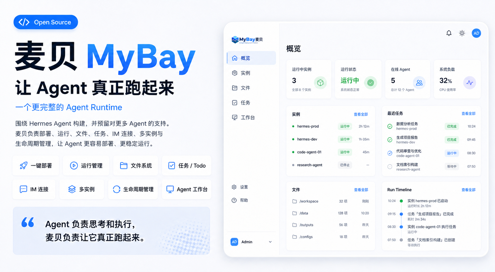
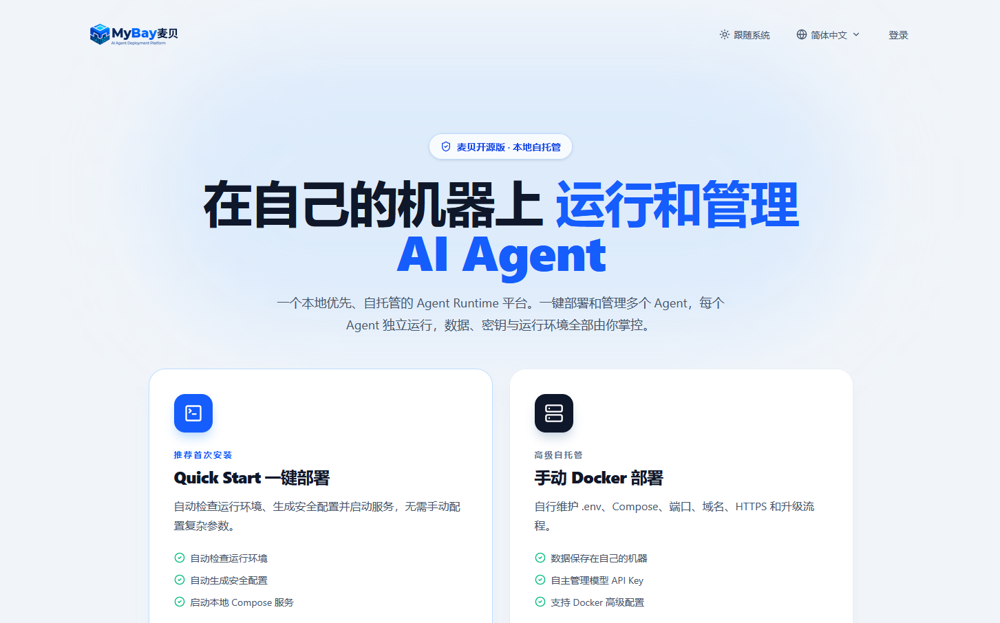
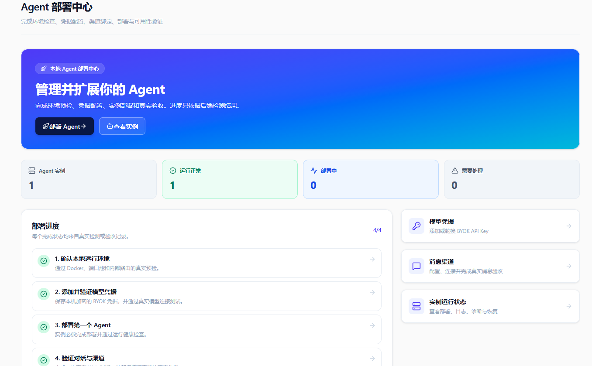
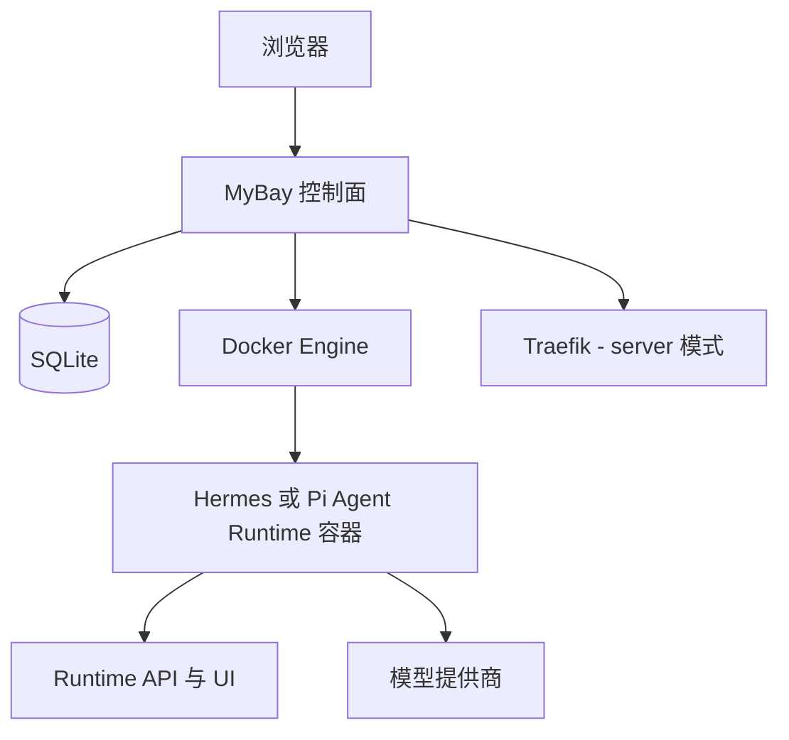

<div align="center">

# 麦贝 MyBay

### 让多个 Agent 真正运行、协作并交付结果。

开源、本地优先的 Agent 控制面。在你自己的电脑或服务器上部署并管理多个相互隔离的 Agent Runtime。

[快速开始](#快速开始) · [为什么选择 MyBay](#为什么选择-mybay) · [Agent 底座](#agent-底座) · [文档导航](#按需求查找文档) · [路线图](./ROADMAP.md)

[](https://github.com/mybay-ai/mybay/actions/workflows/ci.yml)
[](https://github.com/mybay-ai/mybay/actions/workflows/security.yml)
[](https://github.com/mybay-ai/mybay/releases/latest)
[](./LICENSE)

[English](./README.md) · 简体中文

</div>

> **当前正式版：`v0.1.27.1`。** 在 0.x 阶段，公共接口、Runtime Adapter、部署细节与升级行为仍可能调整。



## 为什么选择 MyBay？

能回答问题的 Agent 已经有用；可以部署、读取真实文件、与其他 Agent 协作、被持续观察、升级和恢复的 Agent，才能承担长期工作。MyBay 把这些环节收进一个可自托管的产品里。

| 你的需求 | MyBay 提供的能力 |
| --- | --- |
| **统一管理 Agent** | 在一个控制台完成预检、部署、健康检查、日志、重启、升级、回滚和诊断。 |
| **处理真实工作** | 对话旁直接管理上传、生成文件、变更摘要、预览、下载和持久化工作区。 |
| **支持多个 Agent 底座** | 以一致的产品体验使用已认证的 Hermes Agent 与 Pi Agent。 |
| **Agent 之间真实协作** | 通过 A2A 发现节点、鉴权调用、跟踪委派任务、查看证据、取消任务和恢复状态。 |
| **掌控数据与模型** | 本地 SQLite、隔离 Docker 工作区、自托管部署，以及自带模型凭据。 |
| **面向长期运维** | Runtime 认证、备份、安全守卫、HTTPS 服务器模式、CI 和带校验和的发布产物。 |

MyBay 开源版不依赖托管 SaaS、云端主节点、账号注册或付费额度。Docker 承载 Runtime，SQLite 在你的设备上保存控制面状态。

## 从任务到结果的完整流程

1. **创建 Agent**：选择底座、模型供应商、资源限制和支持的消息渠道。
2. **交给它真实任务**：对话、附加文件、审批敏感工具，并实时查看执行过程。
3. **验收交付物**：预览和下载生成文件，同时保留可归属的运行证据。
4. **需要时发起协作**：通过 A2A 委派任务，并把远端任务跟踪到真实终态。
5. **持续稳定运行**：在控制面完成诊断、备份、升级、回滚和恢复。

## Agent 底座

MyBay 将产品控制面与 Agent Runtime 分离。你可以按任务选择合适的底座，同时保持一致的部署、对话、文件、协作和生命周期体验。

| Agent 底座 | 发布状态 | 适合的工作 | 当前声明的产品能力 |
| --- | --- | --- | --- |
| **Hermes Agent** | 已认证、已验证 | 通用、工具丰富的 Agent 工作流 | 流式与批量对话、文件、Shell、浏览器、定时任务、Web 与已支持的消息渠道 |
| **Pi Agent** | 已认证、已验证 | 编程和工作区类 Agent 工作流 | 流式对话、文件、Shell、停止、会话恢复、审批、用量和 Web 访问 |
| **更多底座** | 路线图 | 更多开源 Agent Runtime | 通过 Runtime 清单、Adapter 契约、能力守卫和认证阶梯接入 |

自动生成的 [Runtime 能力矩阵](./docs/runtime-capability-matrix.md) 是当前声明能力与渠道的事实来源。[MyBay Runtime Certification](./docs/runtime-certification.md) 单独发布基于证据的验证结果；仅注册 Adapter 或声明能力不代表产品 E2E 已通过。

## 快速开始

**Windows 10/11：下载、解压、双击**

从 [Releases](https://github.com/mybay-ai/mybay/releases/latest) 下载 `MyBay-Windows-v*.zip`，解压到 `C:\MyBay` 等普通本地目录，然后双击：

```text
Start-MyBay.bat
```

启动器会检查 Windows、虚拟化、WSL、Docker、端口和镜像网络，在需要时安装并启动 Docker Desktop、拉取固定版本的 MyBay 镜像、让你设置管理员密码，并在健康检查通过后打开浏览器。WSL 安装要求重启时会登记一次性续装任务，重新登录后自动继续。不需要 Git、Node.js、npm 或 OpenSSL。完整说明见 [Windows 快速安装](./WINDOWS-README.zh-CN.md)。

**macOS 或 Linux**

前置条件：Docker Engine 或 Docker Desktop，并启用 Docker Compose。宿主机不需要安装 Node.js。

```bash
git clone https://github.com/mybay-ai/mybay.git
cd mybay
chmod +x quick-start.sh
./quick-start.sh
```

打开 [http://localhost:3000](http://localhost:3000)，添加模型供应商，然后选择 Hermes Agent 或 Pi Agent 底座部署第一个 Agent。不要分享或提交 `.env`。

第一次尝试生成文件时，请在对话输入框旁切换为“Agent模式”。默认的“快速模式”只回复文字，不执行工具或保存文件。

如果需要局域网访问、公网 HTTPS、手动 Compose 或开发模式，请继续查看[其他部署方式](#其他部署方式)，或阅读完整的 **[10 分钟部署第一个 Agent](./docs/QUICKSTART.zh-CN.md)** 教程。

## 产品预览

### 启动属于你的 Agent 控制面

通过 Quick Start 或手动 Docker 部署，在自己的基础设施上运行和管理 AI Agent。



### 部署并管理每一个实例

在本地控制台中完成环境预检、模型凭据配置、Agent 部署、消息渠道连接和运行状态诊断。



### 让对话真正产出文件和结果

在同一界面中与 Agent 对话，并查看执行进度、生成文件、文件变更摘要和支持的文件预览。


## Runtime 项目与署名

MyBay 是独立维护的开源项目。Hermes Agent 与 Pi Agent 是分别维护的第三方项目，MyBay 通过其公开软件包、Runtime 或容器接口进行集成。接入不代表任何赞助、认可或关联；MyBay 不是 Nous Research 或 Earendil Works 的官方产品。

许可证与署名详情见 [THIRD_PARTY_NOTICES.md](THIRD_PARTY_NOTICES.md)。[mybay.ai](https://mybay.ai) 提供的托管服务属于独立商业服务，安装和运行本仓库不需要注册或依赖该服务。

---

## 其他部署方式

> 第一次使用麦贝？请优先使用上面的可复制[快速开始](#快速开始)。本节介绍其他部署模式。

### 方式一：本机桌面一键部署

前置要求：Docker Engine 或 Docker Desktop，以及 Docker Compose。宿主机不需要安装 Node.js。在 Windows 上，用户明确指定后，启动器可以通过 `winget` 安装 Docker Desktop。macOS/Linux 启动器还会使用 `openssl` 和标准 POSIX shell 工具；Windows 启动器直接使用系统内置的 .NET 密码学 API，不要求安装 OpenSSL。

适用于浏览器和 Docker 运行在同一台电脑上的场景：

**Windows PowerShell 5.1 或 PowerShell 7：**

```powershell
Set-ExecutionPolicy -Scope Process Bypass
.\quick-start.ps1 -InstallPrerequisites
```

`-InstallPrerequisites` 会在缺少 Docker Desktop 时安装它，随后启动并等待 Docker 引擎。安装过程可能要求管理员授权或重启 Windows；重启后再次运行同一命令即可。如果 Docker 已安装并正在运行，可以省略该参数，直接执行 `.\quick-start.ps1`。

**macOS 或 Linux：**

```bash
chmod +x quick-start.sh
./quick-start.sh
```

控制台和 Agent 端口默认只绑定 `127.0.0.1`。
如果需要让同一局域网内的其他设备访问，请绑定宿主机一个明确的网卡地址：

```bash
./quick-start.sh --lan 192.168.1.20
```

```powershell
.\quick-start.ps1 -Mode lan -LanBindIp 192.168.1.20
```

### 方式二：公网服务器 + 自动 HTTPS

请先将控制台域名和 Agent 通配域名解析到服务器，然后运行：

```powershell
.\quick-start.ps1 -Mode server
```

或在 macOS/Linux 上运行：

```bash
chmod +x quick-start.sh
./quick-start.sh --server
```

脚本会引导填写控制台域名、Agent 根域名和证书邮箱，自动启动 Traefik、申请 HTTPS 证书，并且只向公网开放 80/443。例如配置 `console.example.com` 和 `*.agents.example.com` 两条 DNS 记录。

> 两个 Quick Start 启动器都会自动创建 `.env`、生成高强度安全密钥和管理员密码，并共享同一套 Docker Compose 与环境变量契约；再次运行时会保留已有服务器模式配置。

---

### 方式三：标准 Docker Compose 手动部署

1. **克隆项目并复制环境变量文件：**
   ```bash
   git clone https://github.com/mybay-ai/mybay.git
   cd mybay
   cp .env.example .env
   ```

2. **生成并配置生产必填安全值：**
   ```bash
   # ENCRYPTION_KEY 与内部路由密钥均为 64 位十六进制字符串
   openssl rand -hex 32
   openssl rand -hex 32

   # JWT_SECRET 至少包含 32 字节
   openssl rand -base64 48
   ```
   将生成值分别写入 `ENCRYPTION_KEY`、`MYBAY_INTERNAL_ROUTING_SECRET` 与 `JWT_SECRET`，并设置 `LOCAL_ADMIN_USERNAME` 和高强度 `LOCAL_ADMIN_PASSWORD`。这些变量与 `docker-compose.yml` 的必填约束完全一致。

3. **使用 Docker Compose 启动：**
   ```bash
   docker compose up -d
   ```
   *（若使用旧版 Docker，可执行 `docker-compose up -d`）*

4. **访问控制台：**
   在浏览器中打开 `http://localhost:3000`，使用配置的管理员账号登录。

---

### 方式四：Node.js 本地开发与运行

#### 前置要求
- Node.js 22.16.0 或更高版本及 npm
- 已安装并启动 Docker Engine / Docker Desktop（用于管理 Agent 容器）

1. **安装依赖：**
   ```bash
   npm install
   ```

2. **配置环境变量：**
   ```bash
   cp .env.example .env
   ```
   编辑 `.env` 文件，填入 `JWT_SECRET`、`ENCRYPTION_KEY` 以及管理员账号密码。

3. **启动开发服务：**
   ```bash
   npm run dev
   ```

4. **生产构建与启动：**
   ```bash
   npm run build
   NODE_ENV=production npm start
   ```

访问 [http://localhost:3000](http://localhost:3000) 进入控制面板。

`VITE_PUBLIC_APP_URL` 与 `VITE_MYBAY_PLATFORM_ORIGIN` 属于构建时变量。Docker Compose 会将其作为 Docker build args 传入 Vite；修改后必须重新构建镜像。服务端运行时变量仍从 `.env` 读取，Compose 则始终以 `NODE_ENV=production` 运行控制面板。

---

## 关键环境变量说明

| 环境变量 | 作用说明 | 默认值 |
| --- | --- | --- |
| `PORT` | Web 控制台监听端口 | `3000` |
| `NODE_ENV` | 服务运行模式；Compose 固定为 production | `.env.example` 中为 `development` |
| `LOCAL_ADMIN_USERNAME` | Web 控制台登录用户名 | `admin` |
| `LOCAL_ADMIN_PASSWORD` | Web 控制台登录密码 | `change-me-now` |
| `JWT_SECRET` | JWT 会话 Token 签名密钥（至少 32 字节） | *在 .env 中替换* |
| `ENCRYPTION_KEY` | AES-256 敏感凭据加密密钥（64 位 hex 字符串） | *必填* |
| `MYBAY_INTERNAL_ROUTING_SECRET` | 实例内部路由认证密钥（64 位 hex 字符串） | *必填* |
| `VITE_PUBLIC_APP_URL` | Docker/Vite 构建时写入前端的公网地址 | `http://localhost:3000` |
| `VITE_MYBAY_PLATFORM_ORIGIN` | 构建时传入前端的平台 Origin | `http://localhost:3000` |
| `MY_BAY_IMAGE` | Hermes Agent 默认 Docker 镜像 | `nousresearch/hermes-agent` |
| `MYBAY_SQLITE_PATH` | 本机 SQLite 数据库文件路径 | `data/mybay.sqlite` |

---

## 本地数据存储说明

应用的所有运行状态、容器配置、对话历史、上传文件和日志均安全地持久化存储在本地 `data/` 目录中：

```txt
data/
  mybay.sqlite        # 本机 SQLite 数据库（实例、凭据、任务和设置）
  instances/          # Agent 实例挂载目录与运行时数据
  uploads/            # 用户上传的文件和资源
  logs/               # 系统与部署日志
```

> **注意：** 请勿将 `data/` 目录提交至 Git 代码仓库。

---

## 安全注意事项

- 本开源版本专为可信本地开发环境和私有服务器设计。
- 公网服务器请使用 `./quick-start.sh --server`；脚本会配置 Traefik 和 HTTPS，并避免将 Agent 动态端口直接暴露到公网。
- Control Plane 为管理实例生命周期需要访问 `/var/run/docker.sock`。该 Socket 可对 Docker daemon 执行高权限操作，实际可能等同于宿主机级管理能力。
- 应将 MyBay 管理员权限视为高权限宿主机管理权限；不要在没有防护的情况下把控制面直接暴露到公网。
- 公网部署必须使用强管理员密码、安全反向代理和 HTTPS，并推荐配合 VPN、私有网络或 IP allowlist。
- 严禁将包含真实 API Key 或敏感密钥的 `.env` 及 `data/` 提交到公开仓库。

---

## Runtime 支持状态

- **Hermes Agent：** 当前可用、可部署，并已通过 MyBay `certified` 级验证。声明能力包括流式与批量对话、停止、文件、Shell、浏览器、定时任务、Web 和已支持的消息渠道。
- **Pi Agent：** 当前可用、可部署，并已通过 MyBay `certified` 级验证。声明能力包括流式对话、停止、文件、Shell 和 Web 访问，同时已接通原生会话恢复、可归属用量、稳定工具事件、审批处理和持久化交付物。

控制面会依据所选 Runtime 的能力声明禁用不支持的功能。依赖具体消息渠道或对话模式前，请查看自动生成的 [Runtime 能力矩阵](./docs/runtime-capability-matrix.md)。

---
## 架构



SQLite 使用 WAL、事务 migration 和明确的 schema version。控制面通过 Docker socket 管理容器；server 模式由 Traefik 统一承载控制台与 Agent Runtime 路由。详见[架构 Source of Truth](./docs/architecture.md)。

## 备份与诊断

```bash
npm run doctor
npm run doctor -- --json
npm run backup -- --output /secure/path/mybay-backup
npm run backup:verify -- --backup /secure/path/mybay-backup
```

Backup 会生成一致的 SQLite 快照，而不是直接复制正在使用 WAL 的数据库；存在时一并保存实例工作区与上传文件，生成带校验和的 manifest，并排除 `.env`、日志、缓存和容器镜像。备份应按敏感数据保护。详见[自托管运维](./docs/self-host-operations.md)。

desktop、LAN、server 三种模式的 Webhook 默认都要求 secret。历史无鉴权 Webhook 必须同时满足实例已保存 `legacy-open` 且管理员显式设置不安全兼容项 `MYBAY_ALLOW_LEGACY_OPEN_WEBHOOKS=true`。

## 发布与路线图

版本 tag 会运行完整质量门、生成干净源码归档、SHA-256 校验和与 SBOM，发布 GHCR 多架构镜像；预发布 tag 不会更新稳定 `latest`。

已完成事项和下一阶段重点见 [ROADMAP.md](./ROADMAP.md)。

## Agent 运行态接入规范 (`mybay.runtime.yaml`)

MyBay 提供可扩展的 **Agent Runtime Specification（运行态接入规范）**，用于接入更多开源 Agent。当前仓库证据中，Hermes Agent 与 Pi Agent 均已通过认证：

- **JSON Schema 校验规范**：`/public/schemas/mybay.runtime.schema.json`
- **运行态规格声明示例**：
  - Hermes Agent：`/public/specs/mybay.runtime.yaml`
  - Pi Agent 运行时清单：`/public/specs/pi.runtime.yaml`

通过定义 `mybay.runtime.yaml` 规格文件，开发者可以标准化声明 Agent 容器端口、健康检查 Endpoint、挂载卷路径及支持的通讯渠道（飞书、Telegram、Discord、Slack、微信等）。

---

## 按需求查找文档

| 我想要…… | 从这里开始 |
| --- | --- |
| 部署第一个本地 Agent | [10 分钟快速开始](./docs/QUICKSTART.zh-CN.md) · [English](./docs/QUICKSTART.md) |
| 选择和比较 Agent 底座 | [Runtime 能力矩阵](./docs/runtime-capability-matrix.md) · [Runtime 认证报告](./docs/runtime-certification.md) |
| 部署到本机或服务器 | [本地部署](./docs/local-deployment.zh-CN.md) · [环境变量](./docs/env.zh-CN.md) |
| 排查部署、对话、渠道或预览故障 | [故障排查](./docs/troubleshooting.zh-CN.md) · [English](./docs/troubleshooting.md) |
| 备份、恢复和维护本地部署 | [本地运维](./docs/self-host-operations.md) |
| 了解信任边界和暴露风险 | [安全说明](./docs/security.zh-CN.md) · [English](./docs/security.md) |
| 管理本地 Runtime 镜像与磁盘占用 | [Docker 镜像缓存](./docs/docker-image-cache.zh-CN.md) · [English](./docs/docker-image-cache.md) |
| 了解系统设计 | [架构](./docs/architecture.md) · [路线图](./ROADMAP.md) |

---

## 贡献指南

欢迎提交适合麦贝开源版定位的改进与 Issue！提交 PR 前请阅读 `CONTRIBUTING.md`。

## 许可证

本仓库采用 `AGPL-3.0-only` 开源许可证。如需商业授权，请单独联系项目所有者。第三方名称、商标及集成 Logo 的相关说明见 [THIRD_PARTY_NOTICES.md](THIRD_PARTY_NOTICES.md)。
