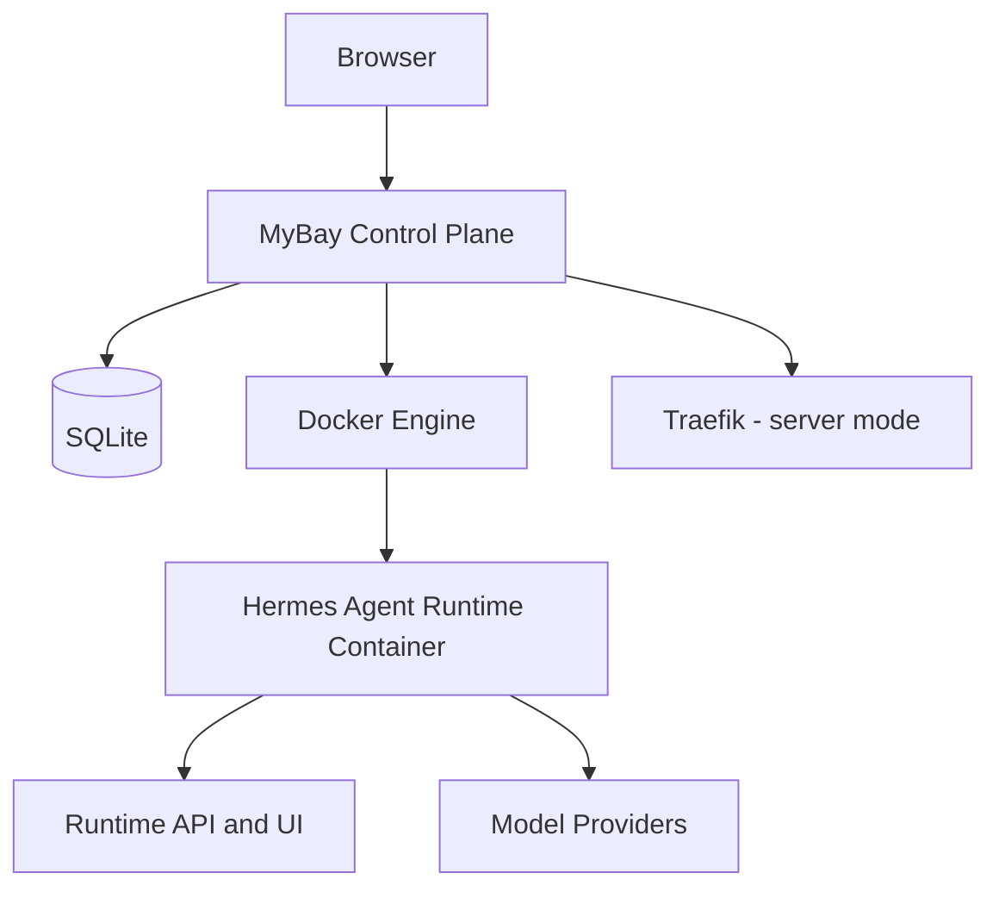

# MyBay Open Source Architecture

This document is the source of truth for the v0.1.x architecture. README files intentionally keep only a short overview.

## Product boundary

MyBay Open Source is a self-hosted, local-first, single-administrator control plane. It does not require a hosted MyBay account and does not provide multi-tenant scheduling, SaaS billing, or a cloud control plane.

## System topology

The Node.js control plane serves the built frontend, owns authentication and configuration, persists platform state, and manages Agent containers through the Docker socket. Docker socket access is equivalent to host-level administrative capability and must be protected accordingly.

## Persistence

Structured control-plane state is stored in `data/mybay.sqlite` by default. SQLite runs with WAL journaling, full synchronous writes, foreign-key enforcement, and a busy timeout. Schema changes are additive, versioned in `localMetadata.schema_version`, and applied inside transactions.

The `data/` boundary contains:

- `mybay.sqlite`: users, encrypted credentials, instances, tasks, chat state, settings, and migration metadata.
- `instances/`: persistent Agent workspaces and runtime-owned instance data.
- `uploads/`: user-uploaded files needed by conversations and runs.
- `logs/`: operational logs; useful for diagnosis but not required for a minimal backup.

Do not copy only the live `mybay.sqlite` file while WAL writes may be active. Use `npm run backup`, which creates a consistent SQLite snapshot and a checksummed manifest. See [Self-host operations](./self-host-operations.md).

## Deployment modes

| Mode | Default network boundary | Routing | Security posture |
| --- | --- | --- | --- |
| desktop | `127.0.0.1` | direct local ports | trusted local machine |
| lan | one explicit host IPv4 | direct LAN ports | firewall and trusted LAN required |
| server | public 80/443 | Traefik and HTTPS | hardened secrets, DNS, TLS, and firewall required |

Webhook authentication defaults to `secret-required` in every mode. Historical `legacy-open` instances work only when both the stored instance setting and `MYBAY_ALLOW_LEGACY_OPEN_WEBHOOKS=true` explicitly opt in; startup emits a mode-specific security warning.

## Runtime lifecycle invariants

The reconciler persists run events and durable terminal state before exposing completion. Lease, recovery, generation/frontier tracking, artifact reconciliation, billing metadata, and text-diff behavior are compatibility-sensitive. Refactors must extract responsibilities incrementally and preserve these ordering guarantees.

## API compatibility

New error responses should use the shared machine-readable code contract and include a request correlation id when available. Compatibility endpoints are tracked in `server/routes/legacyRouteRegistry.ts` with a canonical replacement and review version; aliases are not removed without an explicit compatibility decision.

## TypeScript migration boundary

`tsconfig.strict-boundary.json` is the fully strict boundary for new low-risk shared and service modules. Existing lifecycle core coverage remains in `tsconfig.strict.json`. Planned expansion order is shared modules and repositories, routes, frontend libraries/hooks, then legacy UI components.
